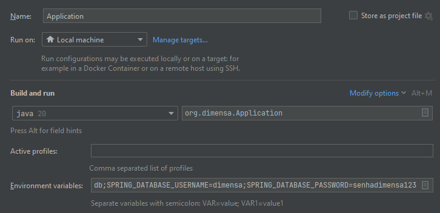

# Spring boot Rest Api

A rest api in Spring Boot to manage contacts

## How to Run

# Docker

1. Clone/Download the repository.

2. Open the project in the IDE (Netbeans/Intellij Idea/Eclipse) and generate the executable .jar file for the
   application. The alternate method to generate the .jar file is through Maven.

3. Open the terminal and go to the directory where docker-compose.yml is located and run the below command in -d (Detach
   Mode) and will build Spring Boot Rest API Containers.

       docker-compose up -d

4. Run the below command to get the list of running containers :

   	   docker ps 

5. After executing above steps without any errors and docker containers are up and running, open the browser and
   navigate to below url:

   	  http://localhost:8000/swagger-ui.html#/

# IDE

1. Clone/Download the repository.

2. Open the project in the IDE (Netbeans/Intellij Idea/Eclipse) and generate the executable .jar file for the
   application.
   The alternate method to generate the .jar file is through Maven or run ```mvn package```.

3. Then run from Spring Boot application and do not forget to inject the environment variables

       SPRING_DATABASE_URL=jdbc:postgresql://dimensadb.crygwiotn2wx.us-east-1.rds.amazonaws.com:5432/dimensadb;SPRING_DATABASE_USERNAME=dimensa;SPRING_DATABASE_PASSWORD=senhadimensa123

   like the image below 
4. To run the tests just create in Run a JUnit test, all routes on controller are covered en tests.

# Deployed system on free service https://render.com/

  	  https://contacts-api-dc6p.onrender.com/swagger-ui.html#/

# Obs:

1. The https://render.com/ free service asks for a /health get route, which is why it was developed.
2. In addition, it has a spin down system with inactivity, so the first request made on the link provided will take a
   significant amount of time, but the other requests will be faster. Therefore, for the first request it will be
   necessary to wait longer than the others.

